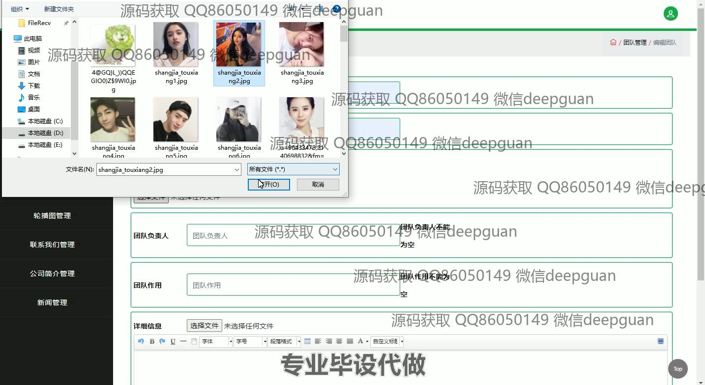
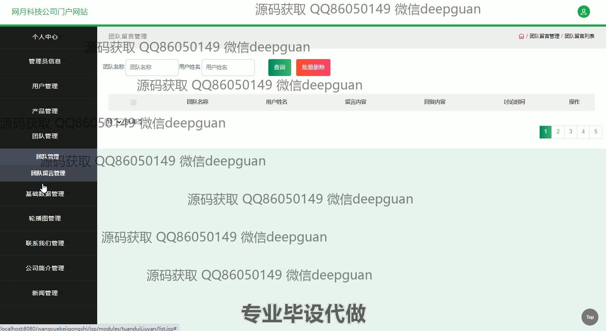
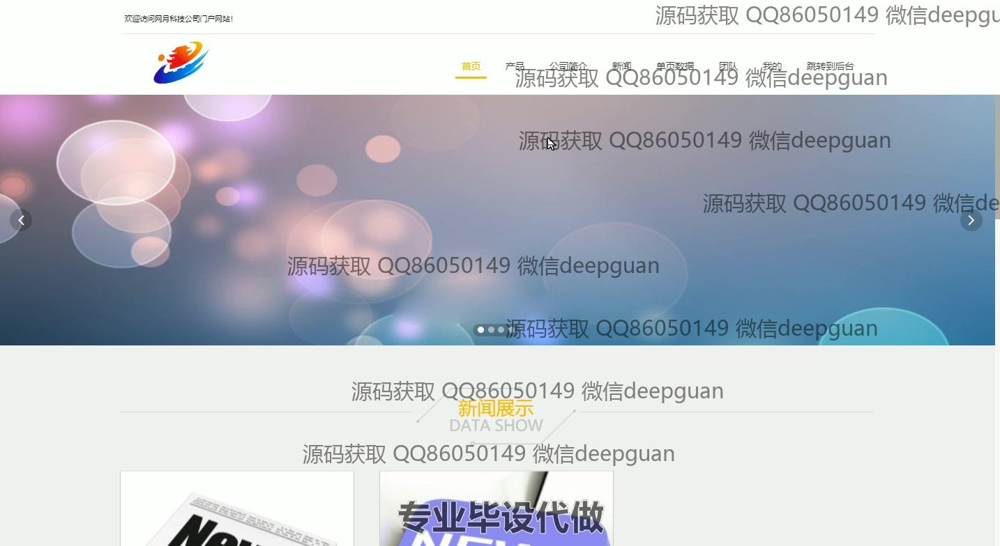
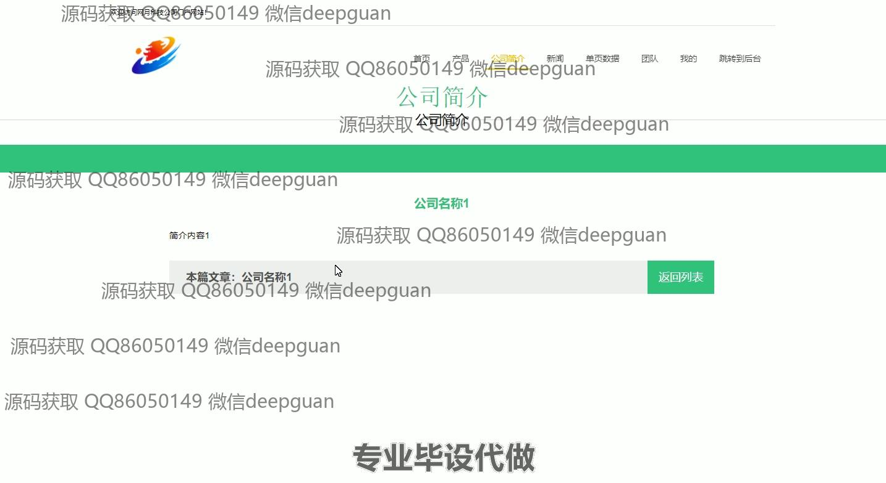

<h1 align="center">网月科技公司门户网站开发与实现</h1>

## 简介
网月科技公司门户网站：角色分为管理员、用户；支持个人信息管理、用户管理、产品管理、团队管理、留言管理、新闻管理、文件上传等多模块功能。    --计算机毕业设计源码；毕设源码；java毕业设计源码

## 联系方式

<h3 align="center">获取完整代码与数据库文件 + 微信：deepguan QQ: 86050149 QQ群: 783742310</h3>

<h3 align="center">可帮忙远程部署 包运行成功！提供远程部署、修改代码、设计文档指导、代码讲解等服务！</h3>

## 功能介绍（完整见运行截图）
管理员：登录、注册和密码管理功能，支持通过后台界面进行用户管理、团队管理、产品管理和新闻管理。可进行查看、添加、修改和删除的操作。支持上传头像和团队图片，以及维护用户个人信息。负责管理和更新网站内容，如公司简介和轮播图，使用导航栏在不同模块中切换。

用户：具有登录和注册功能，能查看和修改个人信息。可访问网站首页，浏览产品和新闻详情，参与留言和反馈。允许在用户中心查看账户信息和收藏内容。支持通过评论板留言，与网站进行互动。

## 运行截图

本代码来源于网络,仅供学习参考使用!

